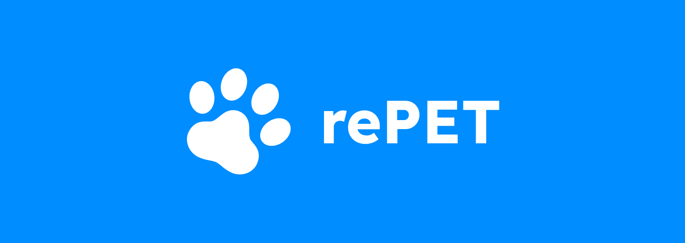

<h1 align="center">
  
</h1>

<p align="center">Tornando o cuidado com o seu pet mais simples e eficaz</p>

<div align="center">
  
  
  
</div>

<ul>
  <li><a href="#-sobre-o-projeto">💬 Sobre o projeto</a></li>
  <ul>
    <li><a href="#-tecnologias">🛠 Tecnologias</a></li>
    <li><a href="#%EF%B8%8F-como-executar">⚙️ Como executar</a></li>
  </ul>

  <li><a href="#-imagens">📷 Imagens</a></li>
</ul>

---

<h2>💬 Sobre o projeto</h2>

O rePET é um assistente digital para a saúde e o bem-estar do seu animal de estimação. Nosso aplicativo facilita o monitoramento de registros da vacinação e dos cuidados diários dos pets, incluindo lembretes para alimentação, banho e mais. Com perfis personalizados para cada pet, garantimos um cuidado atento e adaptado às necessidades de cada um. Junte-se a nós e torne o cuidado com o seu pet mais simples e eficaz!

Este aplicativo foi desenvolvido na disciplina Sistemas de Informação por 5 integrantes, consistindo de diversas etapas: pesquisa de artigo relacionado, elaboração das personas, prototipação das telas no Figma, obtenção de feedback de pessoas utilizando a interface, gerenciamento utilizando Scrum e o desenvolvimento do projeto em si.

Após a pesquisa através de questionários, percebemos que a maior parte do público alvo utiliza dispositivos móveis, então o foco é para dispositivos móveis, existindo a versão para Android, IOS e uma versão web responsiva.

<h3>🛠 Tecnologias</h3>


E [CapacitorJS](https://capacitorjs.com/), para a versão mobile.

<h3>⚙️ Como executar</h3>

<h4> Backend </h4>

Instale as dependências do projeto:


<details>
  <summary>Linux</summary>

  Crie um ambiente virtual:
  ```sh
  python3 -m venv env
  ```

  Ative o ambiente virtual
  ```sh 
  source env/bin/activate
  ```

</details>

<details>
  <summary>Windows</summary>

  Instale o virtualenv:

  ```sh
  pip install virtualenv
  ```

  Crie um ambiente virtual:
  ```sh
  virtualenv env
  ```

  Ative o ambiente virtual
  ```sh 
  env/bin/activate
  ```

</details>


Instale os requirements:

```sh
pip install -r requirements.txt
```

Crie um arquivo chamado `.env` na pasta repet-back

E preencha os respectivos campos com as informações do banco de dados:

```sh
DB_NAME=
DB_USER=
DB_PASSWORD=
DB_HOST=
DB_PORT=
SECRET_KEY=
```

Execute o Backend:

```sh 
python3 repet-back/manage.py runserver
```

<h4> Serviço de Notificações </h4>

Tudo será realizado na pasta `notification-service`

Crie um `.env` e preencha os dados:

```
PUBLIC_KEY=
PRIVATE_KEY=
EMAIL=
ENDPOINT=
DATABASE_URL=
```

Instale as dependências do projeto

```
yarn install
```

E rode o projeto

```
yarn start:dev
```

<h4> Frontend </h4>

Instale o [NodeJS](https://nodejs.org/en/download).

Instale o `yarn`
```sh
npm install --global yarn
```

Instale as dependências do projeto
```sh
yarn install
```

### Versão Web

Execute o projeto
```sh
yarn start
```

Execute o projeto com fake API
```sh
yarn dev
```

#### Android

Instale o [Android Studio](https://developer.android.com/studio).

Dê build no projeto
```sh
yarn build
```

Sincronize o projeto com o Capacitor
```sh
npx cap sync
```

Abra o projeto no Android Studio
```sh
npx cap open android
```

Execute o projeto pelo botão Run do Android Studio.

Para gerar o `.apk`, vá em Build → Build Bundle(s) / APK(s) → Build APK.

---

<h3>📷 Imagens</h3>

